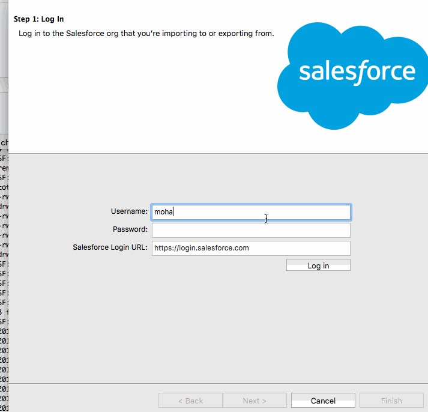

## How to setup and run  SFDC Data Loder
 - Data Loader GUI
 - Data Loader CLI

### Run Data Loader GUI

```bash
bash dataLoader-gui.sh 
  
```
#### DEMO




### Setup for Data Loader CLI

``` bash 
#1. create key; writes the key to conf/encrypt.txt
bash dataLoader-gen-key.sh

#2. encrypt password + security_token using the key in conf/encrypt.txt ; emits the encrypted password, which is need in step-3 for verification
bash dataLoader-pwd-encrypt.sh 

#3. verify the encryption of the password with the key
bash dataLoader-encrypt-verify.sh 6aa32e17b8bbd80444957ff5b0a5b2fa35de1c74fec42826dbbf18dd1c670f2482745c59efac6b81
#2017-01-12 17:56:17,599 INFO  [main] security.EncryptionUtil main (EncryptionUtil.java:332) - Decryption of encrypted value MATCHES the expected value

```

### Sample Run


```
bash dataLoader-cli.sh 
2017-01-12 18:04:34,103 INFO  [main] controller.Controller initLog (Controller.java:396) - Using built-in logging configuration, no log-conf.xml in /Users/mchinnappan/sfdc/notes/cmp-ref/backup/dataloader/log-conf.xml
2017-01-12 18:04:34,108 INFO  [main] controller.Controller initLog (Controller.java:398) - The log has been initialized
2017-01-12 18:04:34,109 INFO  [main] controller.Controller initConfig (Controller.java:334) - config dir created at /Users/mchinnappan/sfdc/notes/cmp-ref/backup/dataloader/conf
2017-01-12 18:04:34,510 INFO  [main] controller.Controller initConfig (Controller.java:362) - The controller config has been initialized
2017-01-12 18:04:34,511 INFO  [main] process.ProcessRunner run (ProcessRunner.java:116) - Initializing process engine
2017-01-12 18:04:34,511 INFO  [main] process.ProcessRunner run (ProcessRunner.java:119) - Loading parameters
2017-01-12 18:04:34,512 INFO  [main] config.LastRun load (LastRun.java:96) - Last run info will be saved in file: /Users/mchinnappan/sfdc/notes/cmp-ref/backup/dataloader/conf/null_lastRun.properties
2017-01-12 18:04:34,518 INFO  [main] process.ProcessRunner run (ProcessRunner.java:127) - Logging in to: https://login.salesforce.com
2017-01-12 18:04:34,521 INFO  [main] client.PartnerClient login (PartnerClient.java:479) - Beginning Partner Salesforce login ....
2017-01-12 18:04:34,536 INFO  [main] client.PartnerClient loginInternal (PartnerClient.java:523) - Salesforce login to https://login.salesforce.com/services/Soap/u/34.0 as user mohan.chinnappan.n10@gmail.com
2017-01-12 18:04:35,073 INFO  [main] dao.DataAccessObjectFactory getDaoInstance (DataAccessObjectFactory.java:51) - Instantiating data access object: out/extractAccountCsv.csv of type: csvWrite
2017-01-12 18:04:35,074 INFO  [main] process.ProcessRunner run (ProcessRunner.java:132) - Checking the data access object connection
2017-01-12 18:04:35,075 INFO  [main] process.ProcessRunner run (ProcessRunner.java:137) - Setting field types
2017-01-12 18:04:36,021 INFO  [main] process.ProcessRunner run (ProcessRunner.java:141) - Setting object reference types
cat o2017-01-12 18:04:37,871 INFO  [main] process.ProcessRunner run (ProcessRunner.java:145) - Creating Map
2017-01-12 18:04:37,873 INFO  [main] action.OperationInfo instantiateAction (OperationInfo.java:95) - Instantiating action for operation: extract
2017-01-12 18:04:37,876 INFO  [main] controller.Controller executeAction (Controller.java:120) - executing operation: extract
2017-01-12 18:04:37,876 INFO  [main] action.AbstractAction execute (AbstractAction.java:122) - Loading: extract
ut2017-01-12 18:04:38,267 INFO  [main] progress.NihilistProgressAdapter setSubTask (NihilistProgressAdapter.java:78) - Processed 14 of 14 total records. Rate: 50,400,000 records per hour. Estimated time to complete: 0 minutes and 0 seconds.  There are 14 successes and 0 errors.
2017-01-12 18:04:38,267 INFO  [main] progress.NihilistProgressAdapter doneSuccess (NihilistProgressAdapter.java:63) - The operation has fully completed.  There were 14 successful extractions and 0 errors.
SF:mchinnappan:~/sfdc/notes/cmp-ref/backup/dataloader:$ cat out/extractAccountCsv.csv 
"ID","NAME"
"00141000007PhyaAAC","John2 Account"
"00141000006ypDgAAI","GenePoint"
"00141000006ypDeAAI","United Oil & Gas, UK"
"00141000006ypDfAAI","United Oil & Gas, Singapore"
"00141000006ypDWAAY","Edge Communications"
"00141000006ypDXAAY","Burlington Textiles Corp of America"
"00141000006ypDYAAY","Pyramid Construction Inc."
"00141000006ypDZAAY","Dickenson plc"
"00141000006ypDaAAI","Grand Hotels & Resorts Ltd"
"00141000006ypDcAAI","Express Logistics and Transport"
"00141000006ypDdAAI","University of Arizona"
"00141000006ypDbAAI","United Oil & Gas Corp."
"00141000006ypDhAAI","sForce"
"001410000075m72AAA","Green Corp"
```


### Scheduling

- You use Jenkins CI to schedule this Data Loader extract based backup 


